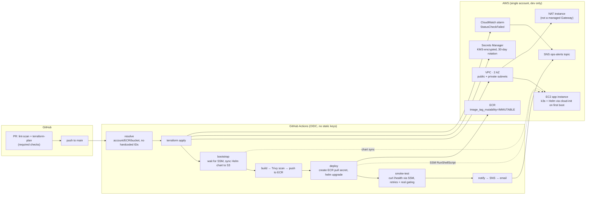

# TaskFlow

A small Express.js task API used as a vehicle to build a real AWS platform end to
end — Terraform, Ansible, Docker, k3s, and a GitHub Actions CI/CD pipeline — under a
fixed $130 credit budget. The app itself is intentionally minimal; the platform
around it is the point.

## What it is

- `GET /health`, `GET /tasks`, `POST /tasks`, `PATCH /tasks/:id`, `GET /metrics`
- `GET /contact`, `POST /contact`, `GET /contact/submissions` — a simple HTML intake
  form (name/email/purpose) backed by its own Postgres table
- Real Postgres backend, self-hosted as a pod in k3s (see [ADR 0006](docs/adrs/0006-no-database-yet.md), now resolved)
- Packaged as a multi-stage, distroless, non-root Docker image
- Runs as 2 replicas behind an Ingress on a single-node k3s cluster, with an HPA
  scaling 2→4 on CPU
- Self-hosted Prometheus + Grafana scraping the app's own metrics — request
  rate, error rate, p95 latency — with real alert rules against the
  [SLOs](docs/runbooks/slos.md) (see [ADR 0007](docs/adrs/0007-self-hosted-prometheus-grafana.md))

## Architecture



Full component-by-component status against the original build plan:
[docs/diagrams/architecture.md](docs/diagrams/architecture.md).

## Repo layout

```
/terraform
  /modules   network, compute, secrets, registry, cicd (+ empty placeholders:
             eks-optional, security)
  /envs      dev (live), prod (placeholder only)
/ansible
  /roles     common-hardening, cloudwatch-agent, webserver, app-deploy, k3s
             (k3s bootstrap now also happens via cloud-init — see ADR 0003)
  inventory/ aws_ec2 dynamic inventory, no hardcoded IPs
/app         the Express API + Dockerfile
/k8s/taskflow  Helm chart
/scripts     up.sh / pause.sh / resume.sh / status.sh / destroy-all.sh
/.github/workflows  ci-cd.yml
/docs
  /adrs         numbered decision records
  /runbooks     rotation, deploy/rollback, pause-resume-destroy
  /postmortems  incident write-ups
  /diagrams     architecture + phase-status
```

## Day-to-day operation

```bash
scripts/up.sh           # terraform apply + start both instances
scripts/status.sh       # 7-phase live report → reports/status-*.md
scripts/pause.sh        # stop both EC2 instances (network/IAM/ECR/secrets untouched)
scripts/resume.sh       # start both instances, wait for SSM online
scripts/destroy-all.sh  # full teardown (state bucket + lock table survive on purpose)
```

CI/CD runs automatically on every push to `main` and on every PR (`lint-scan` +
`terraform-plan` only, gated as required status checks). `apply` and everything
after it only runs on push to `main`.

## Docs

- **ADRs** — [docs/adrs/](docs/adrs/) — the real trade-offs behind NAT instance vs
  Gateway, self-managed k3s vs EKS, cloud-init vs Ansible-in-CI for bootstrap, SSM
  vs a bastion, single-user secret rotation, and the missing database.
- **Runbooks** — [docs/runbooks/](docs/runbooks/) — secret rotation, deploy &
  rollback, pause/resume/destroy.
- **Postmortem** — [docs/postmortems/0001-cold-boot-pipeline-failures.md](docs/postmortems/0001-cold-boot-pipeline-failures.md)
  — four real, independent failures found by actually tearing the environment down
  and rebuilding it from zero, not by reading the code.

## Budget guardrails

Billing alarms fire at $20 / $50 / $80 / $110 against a $130 total credit (SNS →
email). Every resource is tagged `Project` / `Environment` / `Owner` /
`CostCenter` / `TTL`. Between work sessions, run `scripts/pause.sh` — the only
hourly-billed resources are the two EC2 instances (app + NAT); everything else
(VPC, IAM, ECR, Secrets Manager, k3s state on the stopped instance's disk) costs
nothing while stopped.
