# Architecture & build status

For the live request/deploy flow (what happens on a push to `main`), see the
diagram in the [root README](../../README.md#architecture). This diagram is the
complementary view: what's actually built and proven versus what's still open,
mapped against the [original 12-phase build plan](../../README.md).

Green = done and verified live. Amber = built but incomplete or unverified.
Red = not started. Grey = out of scope for now / placeholder.

```mermaid
flowchart TD
  ROOT["TaskFlow platform"]

  ROOT --> P0["Phase 0 — Guardrails"]:::done
  P0 --> P0a["Budget alarms 20/50/80/110"]:::done
  P0 --> P0b["S3 + DynamoDB remote state"]:::done

  ROOT --> P1["Phase 1 — Network"]:::done
  P1 --> P1a["VPC · 2 AZ · public+private"]:::done
  P1 --> P1b["NAT instance (fck_nat)"]:::done
  P1 --> P1c["envs/prod — empty"]:::mute

  ROOT --> P2["Phase 2 — Ansible"]:::partial
  P2 --> P2a["5 roles: hardening, cloudwatch, webserver, app-deploy, k3s"]:::done
  P2 --> P2b["k3s/Helm bootstrap superseded by cloud-init"]:::partial

  ROOT --> P3["Phase 3 — Secrets & Rotation"]:::partial
  P3 --> P3a["Secrets Manager + KMS + 30d rotation"]:::done
  P3 --> P3b["RotationFailed → SNS → email"]:::done
  P3 --> P3c["Rotation runbook"]:::done

  ROOT --> P4["Phase 4 — Observability"]:::partial
  P4 --> P4a["CloudWatch alarm → SNS"]:::done
  P4 --> P4b["Prometheus / Grafana"]:::none
  P4 --> P4c["SLOs documented"]:::none

  ROOT --> P5["Phase 5 — Docker"]:::done
  P5 --> P5a["Multi-stage, distroless, non-root"]:::done
  P5 --> P5b["Trivy scan in CI"]:::done

  ROOT --> P6["Phase 6 — Kubernetes"]:::partial
  P6 --> P6a["k3s node Ready (verified live)"]:::done
  P6 --> P6b["Helm chart: Deploy/Svc/Ingress/HPA"]:::done
  P6 --> P6c["No DB → no PVC needed"]:::mute

  ROOT --> P7["Phase 7 — CI/CD"]:::done
  P7 --> P7a["9-job pipeline, green end-to-end twice"]:::done
  P7 --> P7b["deploy/smoke-test now fail for real"]:::done
  P7 --> P7c["main branch protection: ON"]:::done

  ROOT --> P8["Phase 8 — DevSecOps"]:::partial
  P8 --> P8a["tfsec + gitleaks + Trivy in CI"]:::done
  P8 --> P8b["Dependabot / Access Analyzer"]:::none

  ROOT --> P9["Phase 9 — Resilience & DR"]:::none
  P9 --> P9a["Backup/restore drill"]:::none
  P9 --> P9b["Load test (k6/Locust)"]:::none

  ROOT --> P10["Phase 10 — Cost Optimization"]:::partial
  P10 --> P10a["up/pause/resume/destroy scripts"]:::done
  P10 --> P10b["Automated off-hours stop"]:::none

  ROOT --> P11["Phase 11 — Docs & Job-Readiness"]:::done
  P11 --> P11a["README, ADRs, runbooks, postmortem"]:::done
  P11 --> P11b["Resume bullets / talk-tracks"]:::none

  classDef done fill:#e1f3e6,stroke:#2f8f5b,color:#1f5c3d,stroke-width:1px;
  classDef partial fill:#faedd6,stroke:#a8720e,color:#7a5209,stroke-width:1px;
  classDef none fill:#f8e3e1,stroke:#b23b3b,color:#7a2626,stroke-width:1.5px;
  classDef mute fill:#eceeee,stroke:#8a969a,color:#55666c,stroke-width:1px,stroke-dasharray: 3 3;
```

## What's still open

- **Phase 9 (DR/load test)** — nothing to restore yet (see
  [ADR 0006](../adrs/0006-no-database-yet.md)); a k6 load test against the
  existing API is doable independent of that.
- **Phase 4 (Prometheus/Grafana)** — CloudWatch alarms exist; the self-hosted
  metrics stack from the original plan doesn't.
- **Phase 8 (Dependabot, IAM Access Analyzer)** — not configured.
- **Phase 10 (automated off-hours stop)** — `scripts/pause.sh` covers the manual
  version; no EventBridge-cron Lambda yet.
- **Resume bullets / interview talk-tracks** — the raw material exists (this
  postmortem, these ADRs); the bullets themselves haven't been drafted.
